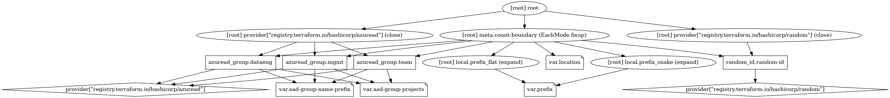

# Terraform AAD Groups
Create groups in AAD with Terraform from a list.

## Requirements

| Name | Version |
|------|---------|
| terraform | >= 0.13 |
| azuread | >=1.0.0 |
| local | >=1.4.0 |
| null | >=2.1.2 |
| random | >=2.3.0 |

## Providers

| Name | Version |
|------|---------|
| azuread | >=1.0.0 |
| random | >=2.3.0 |

## Inputs

| Name | Description | Type | Default | Required |
|------|-------------|------|---------|:--------:|
| aad-group-name-prefix | the prefix to be added to all AAD Group names | `string` | `"contoso"` | no |
| aad-group-projects | the prefix to be added to all AAD Group names | `list(string)` | n/a | yes |
| tags | A map of the tags to use for the resources that are deployed | `map(string)` | n/a | yes |

# Terraform Graph
